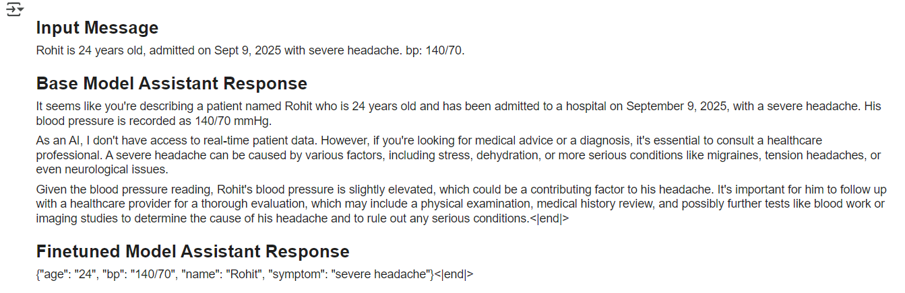

# Phi-3 Mini: Patient Admission Fine-Tuning
- This project fine-tunes the `Phi-3-mini-4k-instruct-bnb-4bit` model using unsloth and trl's `SFTTrainer` on a custom **medical patient admission dataset**.  
- The model learns to generate structured patient admission records from free-text inputs and is later **converted to GGUF format** for fast local inference using Ollama.  

_______________ 
## Outputs
#### **Base Model vs Finetuned Model**


--
#### **Output from Ollama**  


__________________

##  Tech Stack
* **Model:** Phi-3-mini-4k-instruct-bnb-4bit
* **Frameworks & Libraries:**
   * unsloth
   * transformers
   * trl
   * datasets
   * huggingface_hub
* **Serving & Inference:**
   * llama.cpp (GGUF conversion)
   * Ollama (local inference)
* **Environment:** Google Colab  

---------------------------------

## Project Structure
```
finetune-ollama-unsloth/
   │
   ├── assets/
   │   ├── output_comparison.png
   │   └── ollama_output.png
   │
   ├── data/
   │   └── patient_admission.json
   │
   ├── finetune.ipynb
   ├── Modelfile
   ├── README.md
   ├── LICENSE
   └── requirements.txt
```

----------------------------------------

## Setup & Installation
1. **Clone this Repository**

```
git clone https://github.com/7rohxt/finetune-ollama-unsloth.git
cd finetune-ollama-unsloth
```

2. **Install Dependencies**

```
pip install -r requirements.txt
```

*Make sure to enable GPU if you're using Google Colab.*

------------------

## Usage
1. **Prepare Dataset** Place your training data in a file named `patient_admission.json` with `prompt` and `response` fields.
2. **Run Fine-Tuning** Open `finetune.ipynb` and run all cells. This will:
   * Load the base model
   * Convert your JSON data into chat format
   * Fine-tune using LoRA (PEFT)
   * Save both LoRA and merged models
3. **Convert to GGUF and Use with Ollama**
   * Run the last section in `finetune.ipynb` to:
      * Convert merged model to GGUF
      * Quantize it
      * Create an Ollama model
   * Start serving:

```
ollama serve
ollama run phi3-patient-admission "Rohit, aged 45 admitted with chest pain on 24th August, 2025. bp:140/80"
```
----------------------------------------

## Acknowledgements
* unsloth for efficient LoRA fine-tuning
* trl for the `SFTTrainer`
* Hugging Face ecosystem for datasets, model hosting, and hub tools
* llama.cpp and Ollama for local model serving

----------------------------------------

## License
[](https://opensource.org/licenses/MIT)
This project is licensed under the MIT License - see the [LICENSE](LICENSE) file for details.

----------------------------------------

## Contributions
Contributions, issues, and feature requests are welcome! Feel free to **open a pull request or issue** to improve this project.